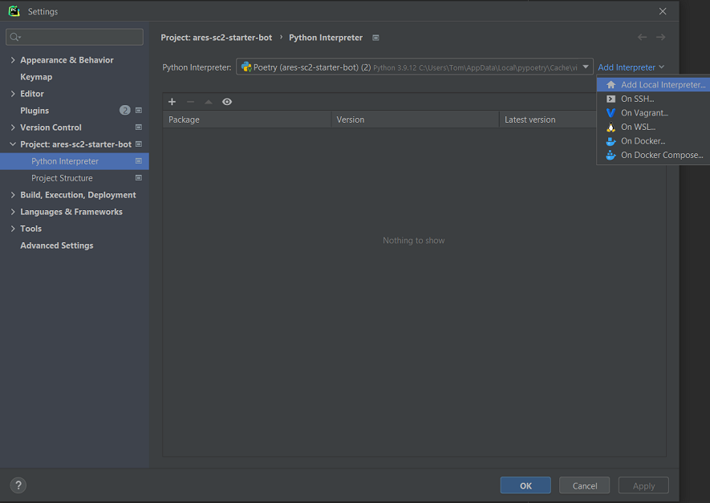
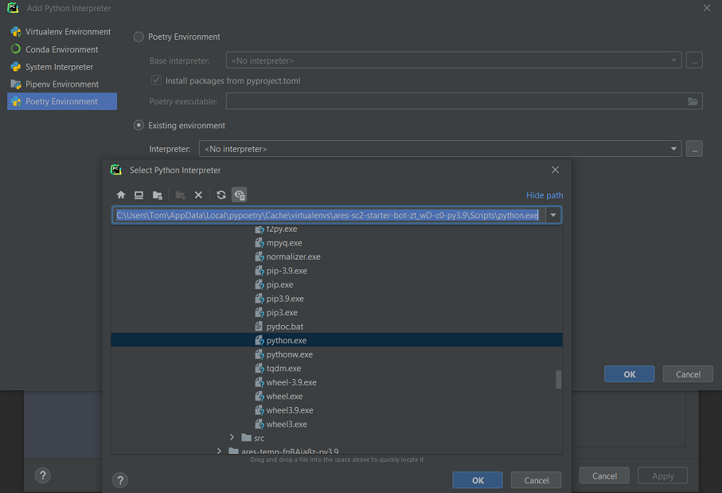
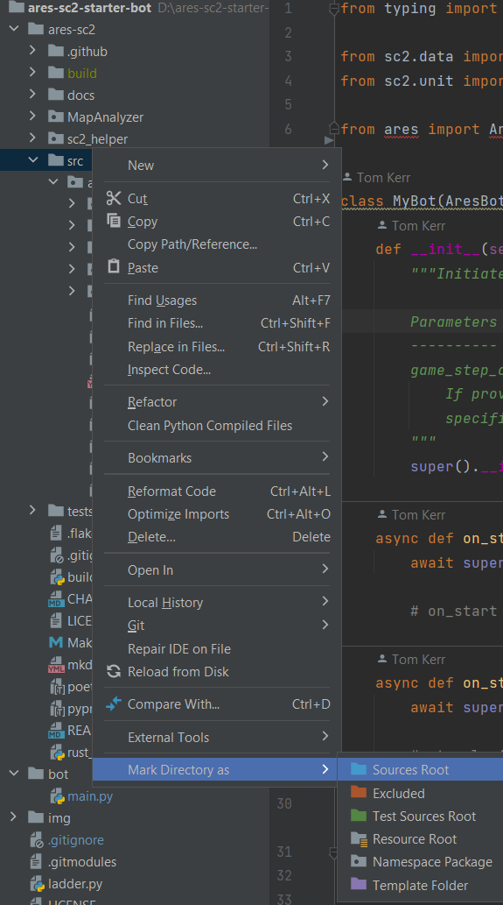

# ares-sc2-starter-bot

[Documentation](https://aressc2.github.io/ares-sc2/index.html)

## Installation:
Prerequisites, ensure these are installed before proceeding:
- Python 3.9+ 
- [Poetry](https://python-poetry.org/)
- [Git](https://git-scm.com/)
- [Starcraft 2](https://starcraft2.com/en-gb/)
- [Maps](https://sc2ai.net/wiki/maps/)

### Setup
If you have a non-standard starcraft installation or are using Linux, please adjust `MAPS_PATH` in `run.py`.

Click the `Use this template` button to create a new repo based on this template.

Then clone the repo, don't forget `--recursive`:

`git clone --recursive <git_repo_url_here>`

Change into your bot's directory:

`cd <bot_folder>`

Install - this will install dependencies, compile cython, and create a new isolated virtual environment:

`poetry install`

#### Run:

Optionally set your bot name and race in `config.yml`

`poetry run python run.py`

#### Start developing
Open up `bot/main.py` and have fun! 

A `ares-sc2` bot is a [python-sc2](https://github.com/BurnySc2/python-sc2) bot by default, so any examples or
documentation in that repo will be relevant here too.

### PyCharm

#### Adding `poetry` environment
Find the path of the environment `poetry` created in the installation step previously, copy and paste
or save this path somewhere.

`poetry env list --full-path`

Open this project in PyCharm and navigate to:

File | Settings | Project: <project name> | Python Interpreter

 - Click `Add Interpreter`, then `Add Local Interpreter`

 - Select `Poetry Environment`, and choose `Existing Environment`
 - Navigate to the path of the poetry environment from the terminal earlier, and select `Scripts/python.exe`

Now when opening terminal in PyCharm, the environment will already be active. New run configurations can be setup,
and they will already be configured to use this environment.

#### Marking sources root
For PyCharm intellisense to work correctly:
 - Right-click `ares-sc2/src` -> Mark Directory as -> Sources Root

   
## Update `ares-sc2`:
This may take a minute or two

`python update_ares.py`

## Format code:
`black .`

`isort .`

## Activating the build runner
Use the example `protoss_builds.yml` as a starting point, rename this file as necessary for your race. If playing as
Random you will need a separate file for each race you want to use the build runner with. in the `Builds`
section of this file start crafting an OpeningBuildOrder. 
[Read the docs here for more info](https://aressc2.github.io/ares-sc2/tutorials.html#build-runner-system)
